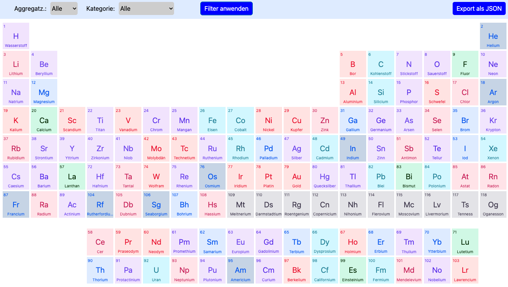

# Installation und Ausführung

## Repository klonen
```git clone https://github.com/TMirow/cicc.git```

## Umgebung starten
```docker compose up -d --build```

## Frontend anzeigen
http://localhost im Browser öffnen

## Ergebnis


## Hinweis
Es war sicherlich Absicht, eine alternative Elementliste, mit z.b. Neon als Übergangsmetall, zu übergeben.
Falls das Ergebnis den Abbildungen in den Lehrbüchern entsprechen soll, dann:

### Korrigierte Elementliste laden
```
docker compose stop backend
vi docker-compose.yaml
```

Eintrag bei backend von
```
    volumes:
      - ./backend/import/:/app/import/
      #- ./backend/import/fixed/:/app/import/
```
in
```
    volumes:
      #- ./backend/import/:/app/import/
      - ./backend/import/fixed/:/app/import/
```
ändern.

```docker compose up -d backend```

Reload der Seite

### Ergebnis:

  

# API
Das Backend stellt lediglich eine Route zum Abrufen der Elemente als JSON bereit. Diese ist erreichbar unter:
```
http://localhost:3000/elements
````
  
# Troubleshooting
In seltenen Fällen schlägt der Start der Datenbank fehl. Hier empfiehlt es sich alle Dienste manuell zu stoppen und einzeln neu zustarten.
Stoppen der Container:
``` 
docker-compose stop db backend frontend
```
  
Starten der Datenbank
``` 
docker-compose start db
```
  
Prüfen, ob die Datenbank läuft:
```
docker ps

CONTAINER ID   IMAGE                COMMAND                  CREATED         STATUS         PORTS                    NAMES
5f6854f4752a   postgres:16-alpine   "docker-entrypoint.s…"   9 minutes ago   Up 2 minutes   0.0.0.0:5432->5432/tcp   postgres_db

docker-compose logs db

postgres_db  | 2025-07-15 09:17:45.998 UTC [1] LOG:  listening on IPv4 address "0.0.0.0", port 5432
postgres_db  | 2025-07-15 09:17:45.998 UTC [1] LOG:  listening on IPv6 address "::", port 5432
postgres_db  | 2025-07-15 09:17:46.008 UTC [1] LOG:  listening on Unix socket "/var/run/postgresql/.s.PGSQL.5432"
postgres_db  | 2025-07-15 09:17:46.026 UTC [29] LOG:  database system was shut down at 2025-07-15 09:14:10 UTC
postgres_db  | 2025-07-15 09:17:46.049 UTC [1] LOG:  database system is ready to accept connections
```

Starten von Frontend und Backend
```
docker-compose start frontend backend
```

 

# Anmerkungen

## Daten-Analyse
Am Anfang habe ich die erhaltene CSV-Datei angeschaut. Erste Ungereimtheiten sind mir direkt aufgefallen. Die Edelgase wollten so gar nicht zu meinem Schulwissen passen. Aber natürlich habe ich den vorhandenen Datenstand verwendet.  
Ich habe an das Periodensystem der Elemente nicht mehr so viele Erinnerungen, aber mir wurde schnell klar, dass ich mit 18 Gruppen die üblichen 12-Cols-Grid-Systeme nicht verwenden kann. Durch den Hinweis auf tailwindcss habe ich herausgefunden, dass hier mit Bordmitteln das Grid-System angepasst werden kann.


## Gedanken zur Umsetzung
Bei der Umsetzung habe ich mich an den empfohlenen Frameworks orientiert.


## Backend-Umsetzung mit express und node.js
Ich habe die letzten Jahre mit express unter node.js gearbeitet und bezeichne mich dort als erfahren.
Einen Seeder mittels parse-csv, Daten-Handling und direkter Zugriff auf die Datenbank sind mir vertraut, auch wenn bis jetzt nur in Verbindung mit mysql-Datenbanken.  
Hier hätte ich die zeitliche Vorgabe von 4 bis 6 Stunden wahrscheinlich einhalten können.


## Backend-Umsetzung mit NestJS
NestJS ist für mich komplettes Neuland. Durch meine Ausflüge in Java Spring (Boot) und C# / ASP.NET Core im Rahmen von Trainingsprojekten ist mir die Art und Weise von Annotation und DependencyInjection nicht mehr ganz unbekannt. Aus diesem Grunde, und da ich einiges an Zeit investieren konnte, habe ich mich entschieden, mit NestJS meine ersten Gehversuche zu wagen.
Der von NestJS mitgebrachte Starter war ein gutes Gerüst. Ich habe mir ein paar Tutorials angeschaut und nach gängigen Best Practices gesucht und habe aufgrund dessen die Struktur 'feature-based' angelegt.  
Auch die Verwendung von Typescript konnte ich so wieder auffrischen.

## Frontend mit Angular
Auch hier habe ich wegen der Trainingsprojekte bereits etwas Erfahrung sammeln können. Die Auslieferung des Frontend's erfolgt über einen nginx-Webserver.  

## Styling mit tailwindcss
Hier habe ich in der Vergangenheit größtenteils mit twitter-bootstrap responsive Grid-Darstellungen erstellt.
Da explizit tailwindcss genannt wurde, habe ich mir dieses angeschaut und auch Tutorials zur Verwendung eines Grid-Systems außerhalb der üblichen 12-cols-Grids gesehen. Allerdings habe ich mir mit der Version 4 wirklich die Zähne ausgebissen, da die von mir gefundenen Quellen anscheinend auf ältere Versionen ausgelegt waren. Deswegen habe ich nach langem Kampf aufgrund des Zeitaufwands, mir die fehlenden CSS-Anweisungen selber zusammen geschustert.

## PostgreSQL
Aufgrund des Frameworks bin ich mit der Datenbank, außer zu Kontrollzwecken mittels pgadmin4, nicht in Verbindung gekommen.
Zur Entwicklungszeit wurde das DB-AdminTool in der docker-compose.yaml verwendet.

```pgadmin:
    image: dpage/pgadmin4
    restart: always
    container_name: nest-pgadmin4
    environment:
      - PGADMIN_DEFAULT_EMAIL=admin@admin.com
      - PGADMIN_DEFAULT_PASSWORD=pgadmin4
    ports:
      - '5050:8080'
    depends_on:
      - db
```

## Aufsetzen des Stacks via docker-compose
Die Verwendung von Docker-base-Images mit Installation benötigter Komponenten war ebenfalls Teil meiner letzten Anstellung und deswegen bekannt.


# Fazit

## Zeitaufwand
Durch die Einarbeitung in NestJS sowie Vertiefung in Angular habe ich die angegebene Zeit klar gerissen. Mein Aufwand liegt bei knapp 3,5 Tagen.

## KI-Tools
Ich habe mich anhand der Starter und den gefundenen Best Practices orientiert und habe auf KI-Tools wie Co-Pilot verzichtet.  
Bei Problemen, die ich auch nach intensiver Recherche nicht lösen konnte, habe ich ChatGPT zur Fehlersuche zu Rate gezogen. Dieses war bei taillwindcss absolut nicht förderlich, da der Versionssprung auf v4 hier zu noch mehr Verwirrung geführt hat.
  
## Fix der erhaltenen Daten
Hier habe ich mittels ChatGPT mir eine CSV erstellen lassen, die der erwarteten Optik entsprach. Ob diese fachlich richtig ist, kann ich beim besten Willlen nicht einschätzen.

## Bonuspunkte
### Responsives Design 
Nur minimal umgesetzt. Lediglich das Anpassen der Ansicht bei verschiedenen Bildschirmgrößen ist umgesetzt. Ein Umbruch des Grid-Systems macht für die gewünschte Darstellung wenig Sinn.

### Admin-Interface
Fehlt komplett. Das hatte im bereits zeitlichen engen Rahmen keinen Platz. Die Vorbereitung für die Umsetzung mittels JSON-Web-Token ist im Frontend mittels auth.interceptor bereits vorhanden.

### Docker-Setup
Eine lauffähige docker-compose.yaml ist vorhanden.

### CI/CD
Hier habe ich keine Erfahrungen und musste es aus Zeitmangel vernachlässigen. 

### Daten-Import via Seeder 
Ist umgesetzt und im Rahmen dieses Projekts die für mich sinnvollere Lösung.

### Export via JSON/CSV
Da die Daten bereits im Frontend vorhanden sind, war die Umsetzung einfach.


